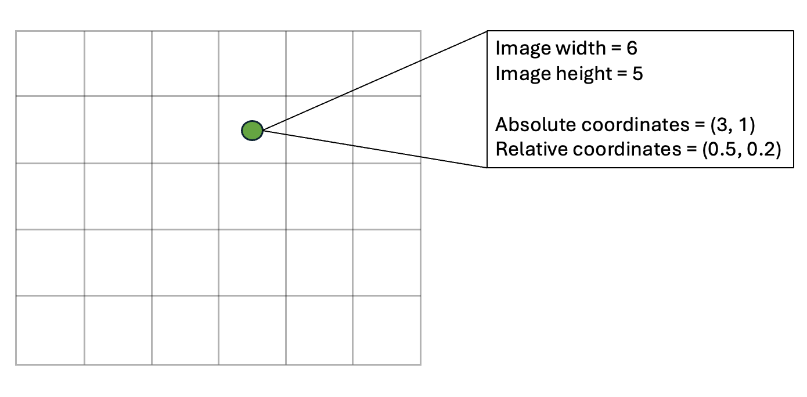
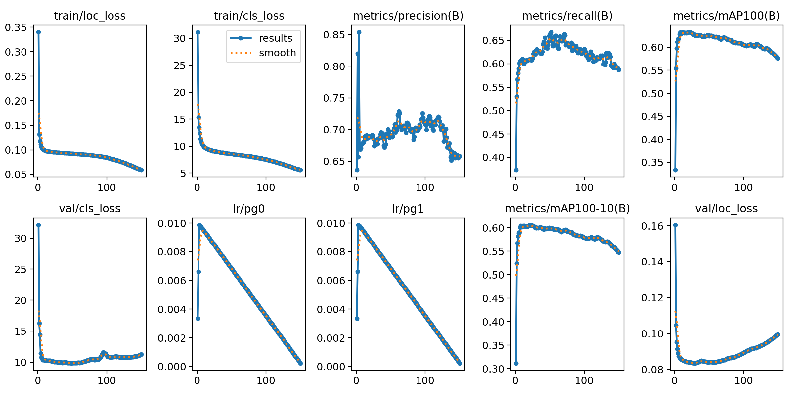
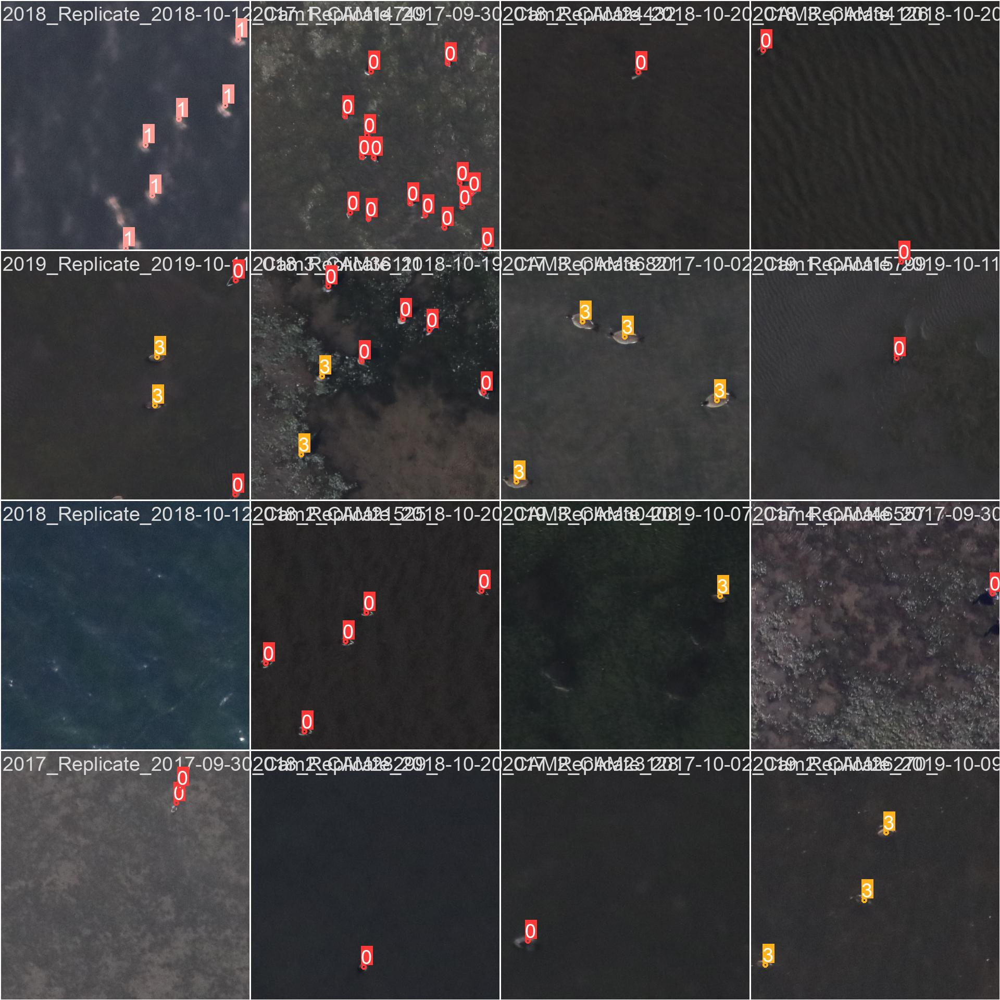

# POLO - Point-based multi-class detectiom

### Polo is a multi-class object detection framework that outputs and trains on point labels. The architecture largely corresponds to the code of the YOLOv8 model developed by [ultralytics](https://www.ultralytics.com), which can be found on the company's official [GitHub](https://github.com/ultralytics/ultralytics/tree/main/ultralytics). For details on POLO and the changes made to the YOLOv8 architecture, you can also refer to [the associated research paper](http://arxiv.org/abs/2410.11741).


## Installation

Like any other python package, POLO can be downloaded and installed using pip:

`pip install git+https://github.com/gigumay/POLO.git#egg=ultralytics`

Since the POLO package is a fork of the ultralytics library, the model can be imported by adding

`from ultralytics import YOLO`

to your script. This will not only give you access to POLO, but also to all YOLO models and functionalities (YOLOv3-8, pose-estimation, segmentation, etc.). For instructions on anything that extends beyond POLO, please consult the official [ultralytics documentation](https://docs.ultralytics.com). Note that POLO was developed in python 3.10, which therefore is the version we reccomend using when working with this package.

## Training POLO

### Data-preprocessing

Datsets should be divided into a training- and validation-set, which should be stored in separate folders. Furthermore, like is the case for YOLOv8, the architecture of POLO is designed to take input images of size 640x640 pixels. If you are working with images that exceed this size, it can be beneficial to split them into patches that match the dimensions expected by POLO. While the framework will accept arbitrary sized inputs, [image tiling has proven beneficial for small object detection](https://openaccess.thecvf.com/content_CVPRW_2019/papers/UAVision/Unel_The_Power_of_Tiling_for_Small_Object_Detection_CVPRW_2019_paper.pdf).
Also, for each image (or image-patch) in the training- and validation-set, the objects it contains must be specified as ground truth labels in a `.txt`-file. The `.txt`-files must be located in the same folder as the corresponding images, and the file-names must be identical (except, of course, for the file extension/format). In the `.txt`-file each object must be defined as a point in a separate line, and every line must be formatted as follows:

`class_id radius x_rel y_rel`

1. `class_id`: An integer number indicating the id of the object class.
2. `radius`: The radius (in pixels) defined for the object class (please refer to [the original POLO paper](http://arxiv.org/abs/2410.11741) for details)
3. `x_rel`: The relative x-coordinate of a point lying on the object (ideally its center-point).
4. `y_rel`: The relative y-coordinate of a point lying on the object (ideally its center-point).

As can be understood, the location of a point label, must be passed as its position relative to the image dimensions. These relative coordinates can be obtained by dividing the absolute coordinates - i.e., the pixel-row and -column - by the image-width/-height. Please see the below graphic for a visual representation of this concept. Note that if an image does not contain any objects, an empty `.txt` file must be generated.



Finally, a `.yaml` file must be created to specify the path to the training- and validation-data, as well as the IDs, names, and radii of the object classes. This file must be structured as follows:

```
path: /path/to/project/main_folder
train: splits/train
val: splits/val

names:
    0: name0
    1: name1
    ...

radii:
    0: radius_class_0
    1: radius_class_1
    ...
```

Importantly, the path specified after the `path` keyword must contain the path to main folder of the project, i.e., the directory that normally contains the training- and -validation folder. The paths after the `train` and `val` keywords must be relative to that main folder. Lastly, The `names` keyword contains a mapping from numerical class IDs (integers; same IDs that go into the `.txt` annotation files) to class names (strings; e.g., "dog"), whereas the radii for all classes must be passed under the `radii` keyword.

To summarize, this is what a project structure matching the above explanations would look like:

```
main_folder
|   
+-- dataset.yaml
|
+-- splits
    |
    +-- train
        |
        +-- img0_train.jpg
        +-- img0_train.txt
        +-- img1_train.jpg
        +-- img1_train.txt
        ...
    +-- val
        |
        +-- img0_val.jpg
        +-- img0_val.txt
        +-- img1_val.jpg
        +-- img1_val.txt
        ...

```

### Loading the model and initiating training

To load POLO please use the following code:

```
from ultralytics import YOLO

model = YOLO("polov8n.yaml")
```

Like YOLOv8, POLO comes in different sizes: n, s, m, l, and x. POLOv8x is the largest and most powerful model, but also needs the most memory and takes the longest to train. You can load whichever version you prefer simply by replacing the `n` in `"polov8n.yaml"` with one of the aforementioned letters:

```
from ultralytics import YOLO
from ultralytics.utils.torch_utils import intersect_dicts

model = YOLO("polov8n.yaml")
```

Once the model is loaded, training can be started with one line:

`model.train()`

This will start training with the default parameters, which have been extensively documented by [ultralytics](https://docs.ultralytics.com/modes/train/#train-settings) and can also be found in [this file](./ultralytics/cfg/default.yaml). Two important differences to the training of a YOLOv8 model are that when using POLO, users can pass a `dor` and `loc` parameter to the `train()` function. Through these parameters, the DoR-threshold to be used during postprocessing and model evaluation (cf. [POLO paper](http://arxiv.org/abs/2410.11741) and the below section on validation for more information), as well as the weight of the localization-loss can be adjusted. In the experiments conducted over the course of the development of POLO, we found that the radii and the DoR notably affect model accuracy. While we did identify a rule of thumb according to which these two parameters can be set, we encourage users to experiment with these settings.

Below is the full code to load and train a POLO model, while using the weights of a pre-trained YOLOv8 and modifying the `dor`/`loc` parameter.

```
from ultralytics import YOLO
from ultralytics.utils.torch_utils import intersect_dicts

model = YOLO("polov8n.yaml")

# remove the next three lines if you wish to train from scratch
ckpt = YOLO(f"yolov8n.pt").state_dict()
intersect = intersect_dicts(ckpt, model.state_dict())
model.load_state_dict(intersect, strict=False)

model.train(dor=0.8, loc=5)
```

POLO will produce a number of outputs during training, including visualizations of the training sampels and graphs showcasing the development of training losses and evaluation metrics. The location where these outputs will be stored can be passed to the training funtcion as well, as explained [here](https://docs.ultralytics.com/modes/train/#train-settings).




## Validation

In terms of code, validating POLO works exactly like validating YOLOv8, which is explained [here](https://docs.ultralytics.com/modes/val/). Conceptually however, the POLO framework measures evaluation metrics such as precision and recall based on the DoR instead of the IoU. More specifically, in YOLOv8 (or generally in bounding-box based object detectors) a prediction is counted as a true positive, if the predicted class is correct, and the predicted bounding box overlaps to a certain degree with the ground truth label. Here, the degree of overlap is measured via the IoU metric. With POLO on the other hand, a prediction is counted as a true positive, if the classes match and the predicted point is sufficiently close to the ground truth, as measured via the DoR. This definition of a true positive allows for the calculation of precision and recall like it is done for YOLOv8, as well as it enables us to define thee `mAP100` and `mAP100-10` metrics. The latter are computed in the same way as the `mAP50` and `mAP50-95` metrics in bounding-box detection, but instead of measuirng a model's accuracy at different IoU thresholds (see [here](https://docs.ultralytics.com/guides/yolo-performance-metrics/#interpreting-the-output) for a more thorough explanation), the performance is assessed based on the DoR value.
It is possible to validate with a DoR threshold and radii that differ from what was used for training. To do so, simply pass a floating point value and a dictionary containing a new radius value for each class ID when calling the validation function. Assuming that the `model` variable holds a trained POLO model:

```
new_radii = {0: 60, 1: 20, 2: 55, 3: 90, 4: 30}
new_dor = 0.8
model.val(radii=new_radii, dor=new_dor)
```

If these parameters are not set, the model will use the default values specified in the [configuration file](./ultralytics/cfg/default.yaml) (DoR threshold = 0.3, radii as used during training).

## Inference

Performing inference on a set of images (or image patches) for which there is no ground truth works exactly the same as with YOLOv8 (no new/additional parameters), and we therefore point towards the [official ultralytics docs](https://docs.ultralytics.com/modes/predict/) for details. You can choose to specifify the DoR-threshold and radii in the same way it is done for model validation. Again, the values default to the radii used during training and the DoR specified  in the [configuration file](./ultralytics/cfg/default.yaml).  For an example on how to eprform tiled inference using `POLO`, please refer to `./examples/POLO_tiled_inference`.

## Closing remarks & missing functionalities

As mentioned earlier, this package gives users access not only to the POLO model, but also to all YOLO architectures and functionalities up to version YOLOv8. Training, validating, and performing inference with a YOLO model requires only to specify the correct model name when   loading the architecture (e.g. `model = YOLO("yolov8x.yaml")` or simply `model = YOLO("yolov8x.pt")` for a pre-trained model - no weight transfer needed). Note however, that for YOLO you will have to adjust your data pre-processing pipeline, since it runs on bounding box labels. More precisely, the box labels in the `.txt` annotation files will have to be specified as follows:

`class_id xmin_rel ymin_rel width_rel height_rel`

1. `class_id`: An integer number indicating the id of the object class.
2. `xmin_rel`: The relative x-coordinate of the top-left corner of the bounding box.
3. `ymin_rel`: The relative y-coordinate of the top-left corner of the bounding box.
4. `width_rel`: The relative width of the bounding box (i.e., its width in pixels divided by the image width).
5. `height_rel`: The relative height of the bounding box (i.e., its height in pixels divided by the image height).


When training YOLO models with the original ultralytics package, users will be prompted to log into weights&biases and a project will be created to monitor training and validation. This feature is missing for POLO, but may be implemented in the future. Pretrained POLO-models are currently unavailable, too.

## Contact

If you run into a bug or have any other kind of concern/question regarding POLO, please reach out:
gigumay@gmail.com
